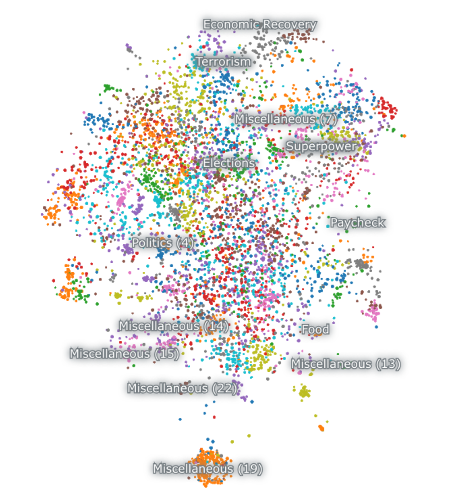

<div align="center">


  
  

  <h1 align="center">
        Visual Map | Reddit comments
    </h1>
    <p align="center"> 
        <i><b>Visualizing maps of Reddit comments based on semantic similarity</b></i>
        <br /> 
    </p>

[![Github][github]][github-url]


  

</div>


## Table of Contents

  <ol>
    <a href="#FREE-200-USD-cloud-credits">💸 FREE 200 USD cloud credits</a><br/>
    <a href="#about">📝 About</a><br/>
    <a href="#how-to-build">💻 How to build</a><br/>
    <a href="#tools-used">🔧 Tools used</a>
        <ul>
        </ul>
    <a href="#contact">👤 Contact</a>
  </ol>

<br/>


## 💸FREE 200 USD cloud credits

Click the banner to activate $200 free personal cloud credits on DigitalOcean (deploy anything).

<div style="display: flex; align-items: center; justify-content: center; width: 400px;"> 
    <a href="https://www.digitalocean.com/?refcode=2aa0ec7cfd0e&utm_campaign=Referral_Invite&utm_medium=Referral_Program&utm_source=badge">
        
    </a>
</div>


## 📝About
- How to automate the extraction, processing, and mapping of Reddit comments using Python and Nomic Atlas
- Use the Reddit API to fetch comments from a Reddit post URL
- Store the data in Nomic Atlas
- Create an Atlas map on the dataset to produce a visualization


## 💻How to build


### 1. Setup:
```
python3 -m venv venv
source venv/bin/activate
pip install -r requirements.txt
```
### 2. Environemnt variables

Get your Reddit developer credentials: https://www.reddit.com/prefs/apps 
```
REDDIT_CLIENT_ID=<your_client_id>
REDDIT_CLIENT_SECRET=<your_client_secret>
REDDIT_USER_AGENT=<your_user_agent>
```

### 3. Data Collection

Run the script to collect Reddit comments:
```
python reddit.py
```


The script will:
- Prompt for a Reddit post URL
- Extract all comments recursively
- Show real-time progress
- Save data to a CSV file

### 4. Data Processing
The script automatically:
- Extracts comment metadata (author, score, timestamp)
- Handles nested comment structures
- Implements rate limiting and error handling
- Saves processed data in a structured format

### 5. Visualization
After data collection, the comments are visualized using Nomic Atlas:
- Creates semantic embeddings of comments
- Generates interactive 2D/3D visualizations
- Clusters similar comments together
- Allows exploration of comment relationships

### Example Output
```
(venv) (base) vdutts7@Vacbook-Vro reddit-map % python reddit.py             
Enter Reddit post URL: https://www.reddit.com/r/pics/comments/5bx4bx/thanks_obama/
Loading comments...
Found 5936 comments to process
Progress: 1.7% (100/5936 comments processed)
Progress: 3.4% (200/5936 comments processed)
Progress: 5.1% (300/5936 comments processed)
Progress: 6.7% (400/5936 comments processed)
Progress: 8.4% (500/5936 comments processed)
Progress: 10.1% (600/5936 comments processed)
Progress: 11.8% (700/5936 comments processed)
Progress: 13.5% (800/5936 comments processed)
Progress: 15.2% (900/5936 comments processed)
Progress: 16.8% (1000/5936 comments processed)
Progress: 18.5% (1100/5936 comments processed)
Progress: 20.2% (1200/5936 comments processed)
Progress: 21.9% (1300/5936 comments processed)
Progress: 23.6% (1400/5936 comments processed)
Progress: 25.3% (1500/5936 comments processed)
Progress: 27.0% (1600/5936 comments processed)
Progress: 28.6% (1700/5936 comments processed)
Progress: 30.3% (1800/5936 comments processed)
Progress: 32.0% (1900/5936 comments processed)
Progress: 33.7% (2000/5936 comments processed)
Progress: 35.4% (2100/5936 comments processed)
Progress: 37.1% (2200/5936 comments processed)
Progress: 38.7% (2300/5936 comments processed)
Progress: 40.4% (2400/5936 comments processed)
Progress: 42.1% (2500/5936 comments processed)
Progress: 43.8% (2600/5936 comments processed)
Progress: 45.5% (2700/5936 comments processed)
Progress: 47.2% (2800/5936 comments processed)
Progress: 48.9% (2900/5936 comments processed)
Progress: 50.5% (3000/5936 comments processed)
Progress: 52.2% (3100/5936 comments processed)
Progress: 53.9% (3200/5936 comments processed)
Progress: 55.6% (3300/5936 comments processed)
Progress: 57.3% (3400/5936 comments processed)
Progress: 59.0% (3500/5936 comments processed)
Progress: 60.6% (3600/5936 comments processed)
Progress: 62.3% (3700/5936 comments processed)
Progress: 64.0% (3800/5936 comments processed)
Progress: 65.7% (3900/5936 comments processed)
Progress: 67.4% (4000/5936 comments processed)
Progress: 69.1% (4100/5936 comments processed)
Progress: 70.8% (4200/5936 comments processed)
Progress: 72.4% (4300/5936 comments processed)
Progress: 74.1% (4400/5936 comments processed)
Progress: 75.8% (4500/5936 comments processed)
Progress: 77.5% (4600/5936 comments processed)
Progress: 79.2% (4700/5936 comments processed)
Progress: 80.9% (4800/5936 comments processed)
Progress: 82.5% (4900/5936 comments processed)
Progress: 84.2% (5000/5936 comments processed)
Progress: 85.9% (5100/5936 comments processed)
Progress: 87.6% (5200/5936 comments processed)
Progress: 89.3% (5300/5936 comments processed)
Progress: 91.0% (5400/5936 comments processed)
Progress: 92.7% (5500/5936 comments processed)
Progress: 94.3% (5600/5936 comments processed)
Progress: 96.0% (5700/5936 comments processed)
Progress: 97.7% (5800/5936 comments processed)
Progress: 99.4% (5900/5936 comments processed)
Completed! Total comments fetched: 5936
Comments saved to reddit_comments_1730443051.csv
```

<video width="100%" controls>
  <source src="public/reddit-map.mp4" type="video/mp4">
</video>

## 🔧Tools Used

[![Python][python]][python-url]
[![PRAW][praw]][praw-url]
[![Pandas][pandas]][pandas-url]
[![Nomic][nomic]][nomic-url]

## 👤Contact

<!-- Replace placeholders with your actual contact information -->
[![Email][email]][email-url]
[![Twitter][twitter]][twitter-url]

<!-- MARKDOWN LINKS & IMAGES -->
<!-- https://www.markdownguide.org/basic-syntax/#reference-style-links -->

[python]: https://img.shields.io/badge/Python-3776AB?style=for-the-badge&logo=python&logoColor=white
[python-url]: https://www.python.org/
[praw]: https://img.shields.io/badge/PRAW-ff4301?style=for-the-badge&logo=reddit&logoColor=white
[praw-url]: https://praw.readthedocs.io/
[pandas]: https://img.shields.io/badge/Pandas-150458?style=for-the-badge&logo=pandas&logoColor=white
[pandas-url]: https://pandas.pydata.org/
[nomic]: https://img.shields.io/badge/Nomic_Atlas-000000?style=for-the-badge&logo=data:image/png;base64,iVBORw0KGgoAAAANSUhEUgAAAA4AAAAOCAYAAAAfSC3RAAAAAXNSR0IArs4c6QAAAARnQU1BAACxjwv8YQUAAAAJcEhZcwAADsMAAA7DAcdvqGQAAAAZdEVYdFNvZnR3YXJlAHBhaW50Lm5ldCA0LjAuMjHxIGmVAAAAEGNhZ3BhY2tldCBiZWdpbj0i77u/IiBpZD0iVzVNME1wQ2VoaUh6cmVTek5UY3prYzlkIj8+IDx4OnhtcG1ldGEgeG1sbnM6eD0iYWRvYmU6bnM6bWV0YS8iIHg6eG1wdGs9IkFkb2JlIFhNUCBDb3JlIDUuMy1jMDExIDY2LjE0NTY2MSwgMjAxMi8wMi8wNi0xNDo1NjoyNyAgICAgICAgIj4gPHJkZjpSREYgeG1sbnM6cmRmPSJodHRwOi8vd3d3LnczLm9yZy8xOTk5LzAyLzIyLXJkZi1zeW50YXgtbnMjIj4gPHJkZjpEZXNjcmlwdGlvbiByZGY6YWJvdXQ9IiIgeG1sbnM6eG1wPSJodHRwOi8vbnMuYWRvYmUuY29tL3hhcC8xLjAvIiB4bWxuczp4bXBNTT0iaHR0cDovL25zLmFkb2JlLmNvbS94YXAvMS4wL21tLyIgeG1sbnM6c3RSZWY9Imh0dHA6Ly9ucy5hZG9iZS5jb20veGFwLzEuMC9zVHlwZS9SZXNvdXJjZVJlZiMiIHhtcDpDcmVhdG9yVG9vbD0iQWRvYmUgUGhvdG9zaG9wIENTNiAoV2luZG93cykiIHhtcE1NOkluc3RhbmNlSUQ9InhtcC5paWQ6RjY3NjM0QTY5NzNFMTFFNUI2QUQ4NTY1OTg1QTRFMUQiIHhtcE1NOkRvY3VtZW50SUQ9InhtcC5kaWQ6RjY3NjM0QTc5NzNFMTFFNUI2QUQ4NTY1OTg1QTRFMUQiPiA8eG1wTU06RGVyaXZlZEZyb20gc3RSZWY6aW5zdGFuY2VJRD0ieG1wLmlpZDpGNjc2MzRBNDk3M0UxMUU1QjZBRDg1NjU5ODVBNEUxRCIgc3RSZWY6ZG9jdW1lbnRJRD0ieG1wLmRpZDpGNjc2MzRBNTk3M0UxMUU1QjZBRDg1NjU5ODVBNEUxRCIvPiA8L3JkZjpEZXNjcmlwdGlvbj4gPC9yZGY6UkRGPiA8L3g6eG1wbWV0YT4gPD94cGFja2V0IGVuZD0iciI/Pg==
[nomic-url]: https://atlas.nomic.ai/
[email]: https://img.shields.io/badge/me@vd7.io-FFCA28?style=for-the-badge&logo=Gmail&logoColor=00bbff&color=black
[email-url]: #
[github]: https://img.shields.io/badge/💻Github-000000?style=for-the-badge
[github-url]: https://github.com/vdutts7/blockchain-js
[twitter]: https://img.shields.io/badge/Twitter-FFCA28?style=for-the-badge&logo=Twitter&logoColor=00bbff&color=black
[twitter-url]: https://twitter.com/vdutts7/
